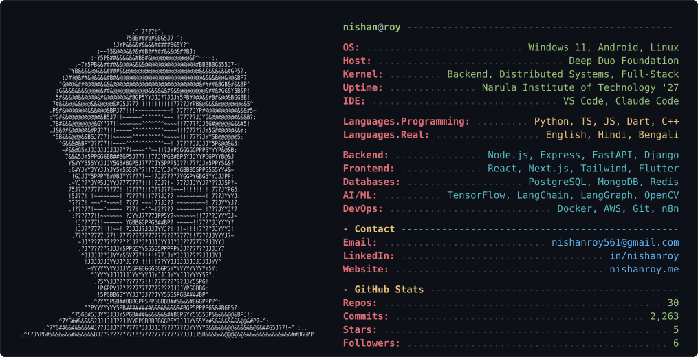

<!--
  GitHub profile README for nishanroy561
  Repo must be named exactly: nishanroy561/nishanroy561  (matches your username)
  Place this README.md and neofetch.svg at the repo root.
-->

  

<h3 align="center">Software Engineer &nbsp;|&nbsp; AI Engineer &nbsp;|&nbsp; Backend, Distributed Systems &amp; Full-Stack</h3>

  
  
  

---

### 🚀 Featured Projects

- **[Notizz AI](https://notizzai.ddfrl.com)** — AI news-analysis platform. Dual backend (Express + FastAPI), fine-tuned DistilBERT for sentiment/bias, TextRank summarization, MinHash+LSH near-duplicate detection, HNSW semantic fact-checking. Companion Flutter app.
- **[ShipIntern](https://github.com/nishanroy561)** — AI internship-discovery platform serving 250+ users. LLM query-understanding → structured search, BM25 ranking, Jaro–Winkler cross-source dedup. Next.js + TypeScript.

---

  
  

  

